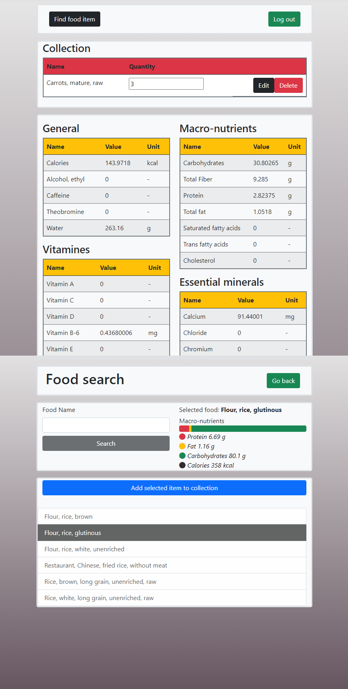

## Description
The application enables users to track the nutrient content of various food items. It allows for searching the USDA food database and lets users to add food items to a collection. The app aggregates the nutrients from these items and displays nutritional information to help users monitor their intake.
## Features
- **USDA database integration:** Searching for foods in the USDA food database
- **Food logging:** Adding foods to a collection
- **Nutrient tracking:** Displaying the nutrient content of a collection
## Technologies used
- ASP.NET
- HTML/CSS
- Azure database
- Bootstrap
## Showcase

